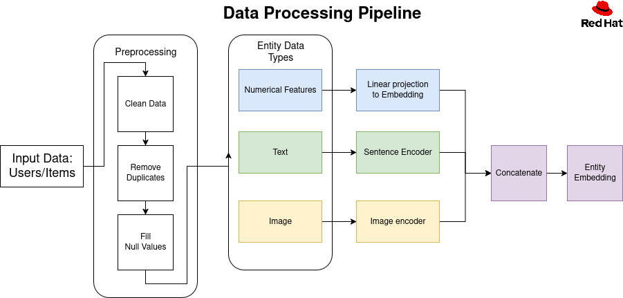
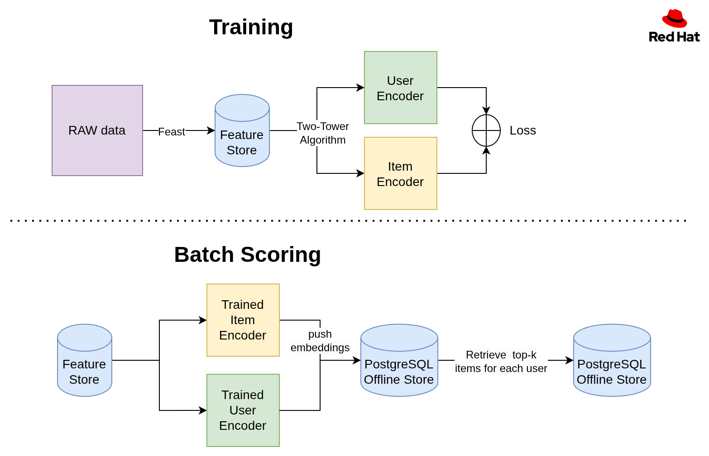
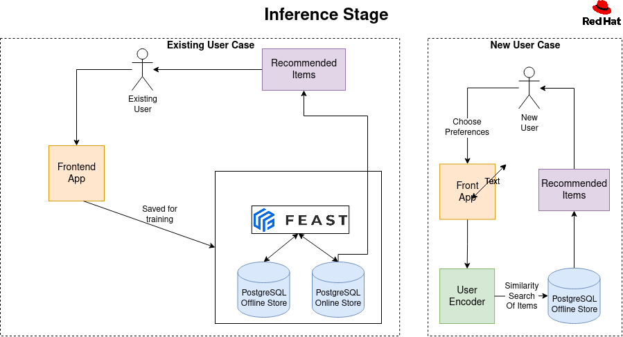
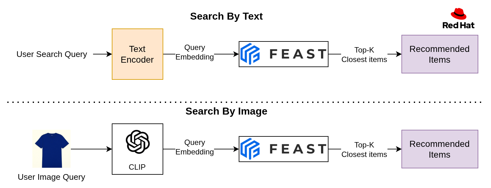
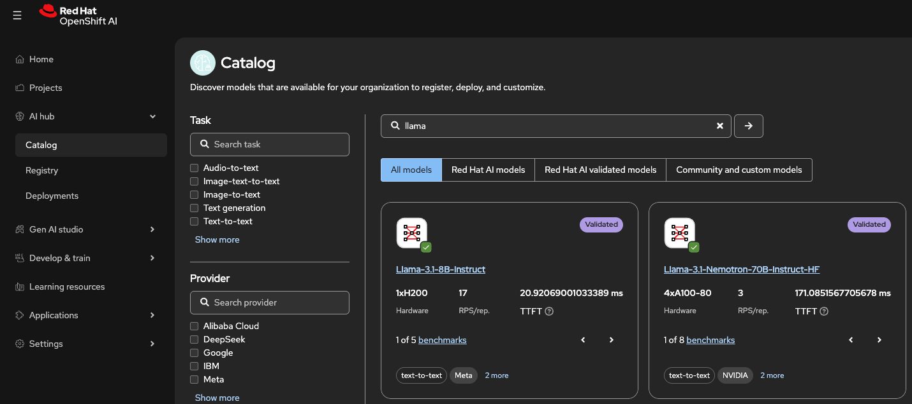

# Transform product discovery with AI recommendations

Integrate AI-driven product recommendations, automated review summarization, and enhanced search capabilities into an e-commerce storefront.

## Detailed description

This quickstart shows how an e-commerce storefront can seamlessly integrate AI-driven product recommendations, automated review summarization, and enhanced search capabilities to improve customer engagement and conversion rates.

* **Product recommendations** deliver personalized suggestions based on browsing history and product similarity, helping customers discover what they love.
* **Review summaries** distill countless reviews into actionable information, accelerating buying decisions.
* **Intelligent search** uses a hybrid approach with semantic and symbolic search understanding customer intent, making it easier to find the perfect item.

See how customers can get a better experience while business owners unlock higher click-through rates, better conversations and strong customer loyalty.

This quickstart is a complete, cloud-native product recommender system showcasing search, recommendations, reviews, and a Kubeflow training pipeline on OpenShift AI. Technical components include:
- Backend (FastAPI) with PostgreSQL + pgvector + Feast
- Frontend (React) with semantic text/image search
- Training pipeline (Kubeflow Pipelines) to build and push embeddings
- Helm charts for one-command install/uninstall on OpenShift


### Architecture diagrams
- Feature Store: Feast (offline Parquet, online Postgres + pgvector)
- Embeddings: Two-tower training + BGE text encoding for search
- Search: Approximate Nearest Neighbor search over semantic vector embeddings
- Images: Synthetic catalog images; text-to-image generated assets










---

## Requirements

### Prerequisites
- Access to an OpenShift cluster (with OpenShift AI installed)
- CLI tools: `oc` and `helm`
- Container registry access to push images (e.g., quay.io)

Recommended OpenShift AI components enabled: DataSciencePipelines, Feast Operator, Model Registry, KServe/ModelMesh (Managed in your `DataScienceCluster`).

### Minimum hardware requirements

- **CPU**: 6-8 cores
- **Memory**: 16-20Gi
- **Storage**: 150-200Gi

### Minimum software requirements

- **OpenShift 4.17.0+** cluster with OpenShift AI
- **oc CLI 4.17.0+** and **Helm 3.x**
- **Access to quay.io** to be able to pull down container images

### Required user permissions

- **Namespace admin** permissions in the target OpenShift project
- **Container registry access** to pull images from quay.io and registry.redhat.io
- **OpenShift AI access** to create DataSciencePipelines and Feast components
- **Storage provisioning** rights to create persistent volumes (PVCs)

---

## Deploy

1) Clone and enter the repo
```bash
git clone https://github.com/<your-username>/product-recommender-system.git
cd product-recommender-system/helm
```

2) Install
```bash
make install NAMESPACE=<namespace> minio.userId=<minio user Id> minio.password=<minio password> MODEL_NAME=<ollama model name> MODEL_ENDPOINT=<http://model-url.com/v1>
```
This deploys: Postgres+pgvector, Feast registry/secret, backend, frontend, and the training pipeline server.

3) Access routes (after pods Ready)
```bash
# Frontend URL
FRONTEND=$(oc -n <ns> get route product-recommender-system-frontend -o jsonpath='{.spec.host}')
echo "https://$FRONTEND"

# Pipeline UI (DSP) URL
DSP=$(oc -n <ns> get route ds-pipeline-dspa -o jsonpath='{.spec.host}')
echo "https://$DSP"
```

### Delete
```bash
make uninstall NAMESPACE=<ns>
```

---

## Additional details

### RHOAI 3.0 Model Deployment Steps



1. **Open Catalog**: In the left-hand menu, select **AI Hub > Catalog**. Choose the model you wish to deploy and click **Deploy model**.

2. **Configure Deployment**: In the deployment dialog, select your project and configure:
   - **Resource Name**: Note the pre-populated name; you will need this later.
   - **Serving Runtime**: Select the runtime appropriate for your hardware (e.g., vLLM NVIDIA GPU ServingRuntime for KServe).
   - **Deployment Mode**: Choose KServe RawDeployment (unless scale-to-zero is required).
   - **Replicas & Size**: Set the number of replicas (e.g., 1) and server size (e.g., Medium) based on pod requirements.
   - **Accelerator**: Specify the hardware (e.g., A10G NVIDIA GPU) and count.
   - **Authentication & Access**:
     - Check *Make deployed models available through an external route* for outside access.
     - Check *Require token authentication*. Always enable this for external routes and store the token securely.
   - **Configuration Parameters**: Add required flags (e.g., `--max-model-len=8096 --task=generate --trust_remote_code`). Refer to the [Red Hat AI Inference Server documentation](https://docs.redhat.com/en/documentation/red_hat_openshift_ai_self-managed/3.0/html/deploying_models/deploying_models) for details.

3. **Deploy**: Click **Deploy**.

4. **Retrieve Endpoints**: Once deployed, go to **Data Science Projects**, select your project, and click the **Models** tab.
   - Click *Internal and external endpoint* to view the URLs. Record both, as some client applications cannot resolve internal cluster addresses.
   - Expand the model list item (using the arrow on the left) and scroll down to copy the **Token authentication** value.

Your model is now ready. Use the endpoint URL, authentication token, and resource name in the `make install` command.

### Configuration you'll change most often
- Images
  - Backend+Frontend: `frontendBackendImage` in `helm/product-recommender-system/values.yaml`
  - Training: `pipelineJobImage` (training container image)
  - Core library (as a base in backend image): `applicationImage` (if used)
- LLM for review generation (optional)
  - Set `llm.secret.data.LLM_API_KEY` (or bring your own secret)
  - Backend env: `USE_LLM_FOR_REVIEWS`, `LLM_API_BASE`, `LLM_MODEL`, `LLM_TIMEOUT`
- Database/Feast integration
  - DB connection comes from the `pgvector` secret (created by the chart)
  - Feast TLS secret name: `feast-feast-recommendation-registry-tls` (mounted in backend & training)


### How search works
- Semantic Approximate Nearest Neighbor search over item text embeddings (BGE)

If you add more modalities (e.g., category vectors), stack only equal-dimension tensors or compute per-field similarities and fuse (max/weighted) without stacking.


### AI Review Summarization
- **What it does**: Uses an LLM to condense recent product reviews into a short, helpful summary covering sentiment, pros, cons, and an overall recommendation.
- **Endpoint**:
  - `GET /products/{product_id}/reviews/summarize` — returns AI-generated summary text.
- **Notes**:
  - Requires at least 4 reviews to produce a summary; otherwise returns a friendly message.
  - Review summary generated real time upon clicking the 'AI Summarize' button on the product page.


Detailed docs live in component READMEs:
- `recommendation-core/README.md`
- `recommendation-training/README.md`
- `backend/README.md`
- `frontend/README.md`
- `helm/README.md`

---

## Contributions
- Contributions welcome via PRs; please update component READMEs when changing behavior

## Tags

* **Industry:** Retail
* **Product:** OpenShift AI
* **Use case:** Personalization
